# Calorie Expenditure Analysis and Prediction 

## Dataset

This dataset was obtained from kaggle, and represents the total calories expended by 750,000 participants over the course of a treadmill workout based on measurements taken with a respirometer, which is a mask that measures CO2 output and can be used to directly calculate caloric consumption.

The objective is to model calorie expenditure such that we could obtain an accurate prediction of calorie expenditure on a new person without them having to wear a cumbersome mask.

It contains the following features:

- *Height*: in cm
- *Weight*: in kg
- *Body temp*: in degrees Celsius 
- *Age*: in years, ranging from 20 to 80
- *Duration*: how long each participant exercised for, in minutes
- *Heart rate*: the participant's average heart rate over the course of the workout, in bpm
- *Sex*: the participant's gender
- *Calories*: the total calories expended over the course of the workout

## Setup

If you have uv installed, you can reproduce my virtual environment with 

```shell
uv sync
```

## Exploratory Data Analysis

All EDA contained in [this notebook](notebooks/analysis.ipynb).

### Univariate

There were 7 total quanitative features, which have distributions shown below:

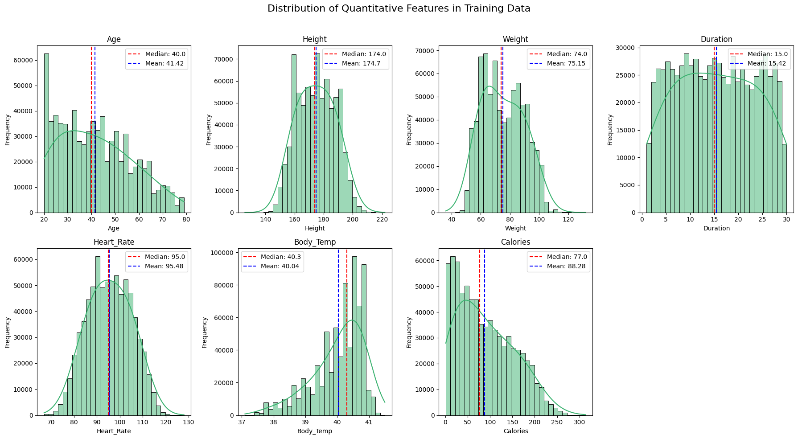

**Observations and Insights**

- no apparent extreme values / outliers that could break models in any of the quantitative features
- left skew for body temperature, right skew for calories burned, slight right skew for age
- roughly equal number of men and women in the training set

### Bivariate

To analyze correlations between features, I made the following correlation heatmap and pairplot

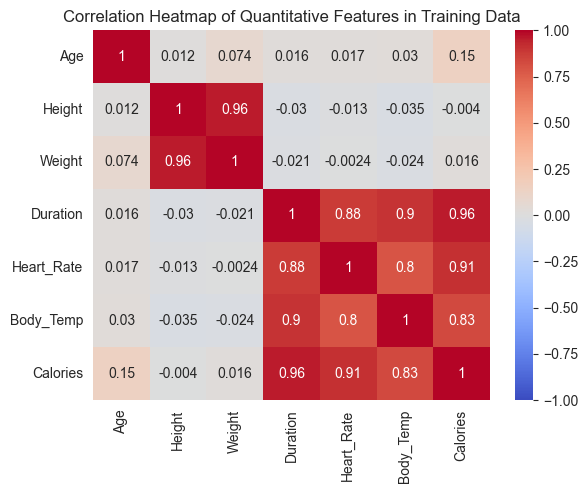

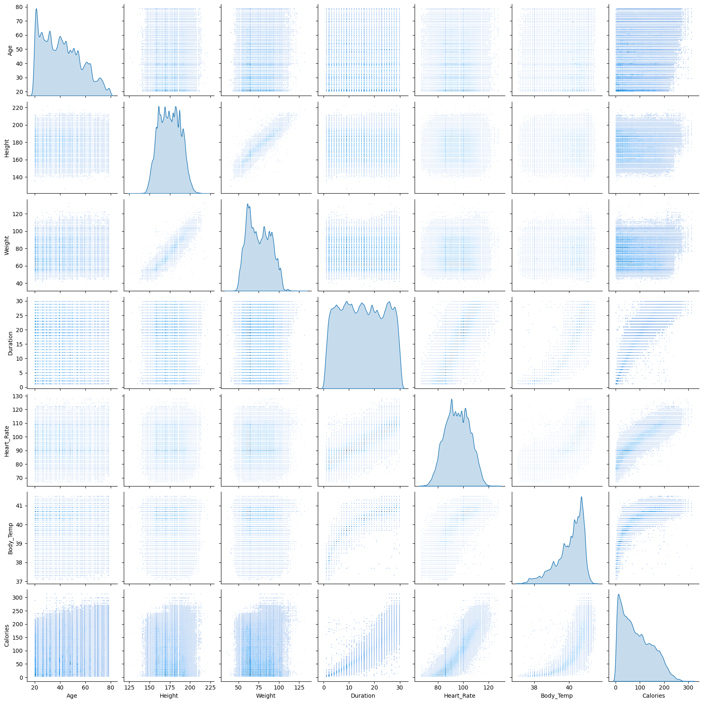

Next, I wanted to see any differences in feature distributions between men and women, so I created the following histograms for each:

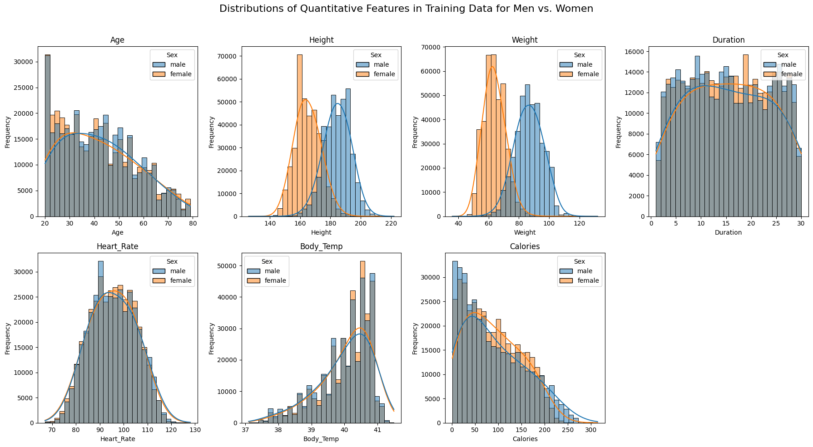

**Observations and Insights**

- strong linear correlation between height and weight (r=.96)
- clear nonlinear relationship between body temperature and calories. Could explore log, sqrt, or exp to improve performance for linear model
- duration, heart rate, and body temperature are all positively correlated with calories burned. This makes logical sense to me
- significant differences mainly in height and weight for men and women (men higher for both) based on both computed stats and kde plots

## Models

All modeling contained in [this notebook](notebooks/model.ipynb)

### Model Selection and Tuning

For this problem, I initially experimented with a simple linear model and two regularized models (lasso and ridge) as a baseline. The following plots show the true calorie expenditure vs. the models' predictions, with the dashed black line represented a "perfect fit".

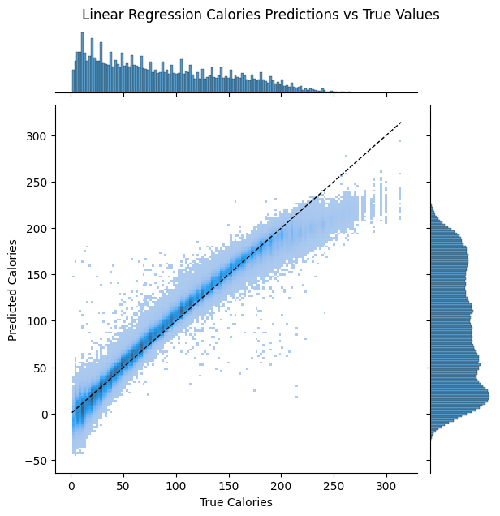
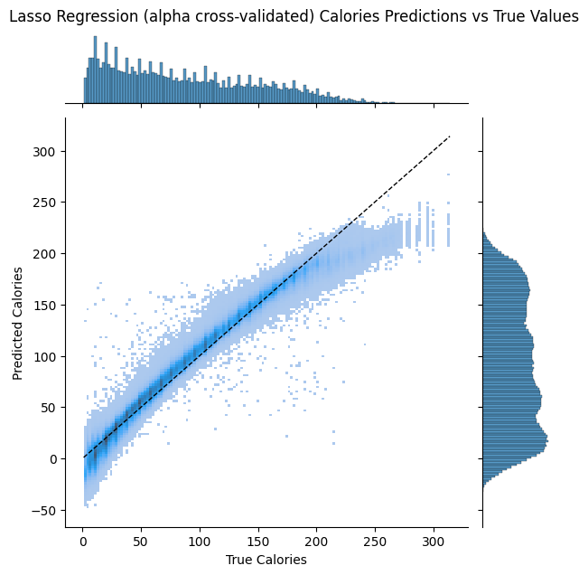


**Some Takeaways From the Linear Models**: 

- The performance on all three of these models is fine. Honestly you could move forward with these and not bother with tuning an Xgboost model

- One thing that's interesting is how it looks like there is a nonlinear trend in the predictions vs the true values. It's possible these models would benefit from linearizing body temperature the way I did in the analysis notebook, but I explained there that it causes some numerical stability problems. 

- Also, regularization didn't help much (both for L1 and L2)

- Overall, I think if you wanted to just use these linear models you'd be fine.

- Additionally, you really could just use a linear model with only duration. This would be highly interpretable and would allow people to calculate how many calories they would burn with either a simple calculator or even in their head.

Next, I experimented with the default xgboost and random forest regressors, which gave the following results:

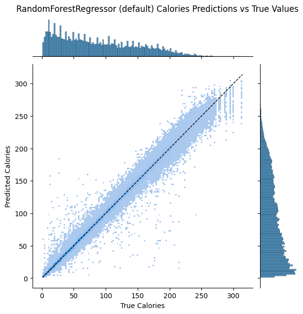
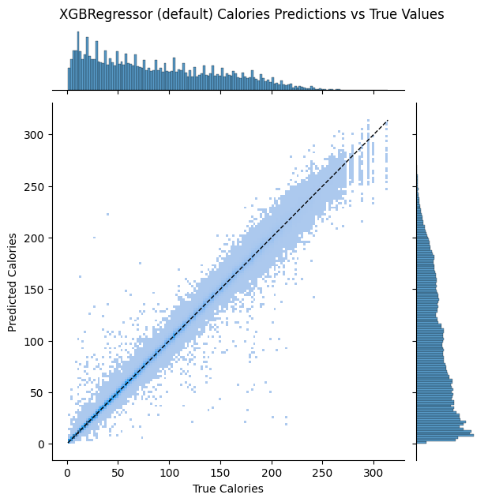

Although the random forest performed slightly better, I chose to move forward with the xgboost model primarily because it was much faster (6 seconds vs 200 seconds), making it much more amenable to hyperparameter tuning with optuna

I started with recursive feature elimination, which resulted in the removal of 'Height' and 'bmi' (a feature I engineered that turned out to be useless, lol).

For hyperparameter tuning, I used optuna to tune the min child weight (the minimum weight assigned to the children in a node to split) and the learning rate. The metric
minimized was root mean squared log error (specified by kaggle) calculated with 5-fold cross validation, and optimization was done for 50 trials prior to selecting optimal parameters.

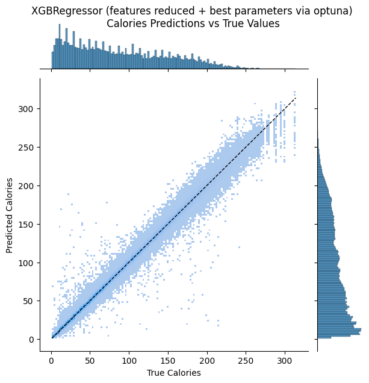

The final comparison between all models' mean squared errors (MSEs) gave looks like this:

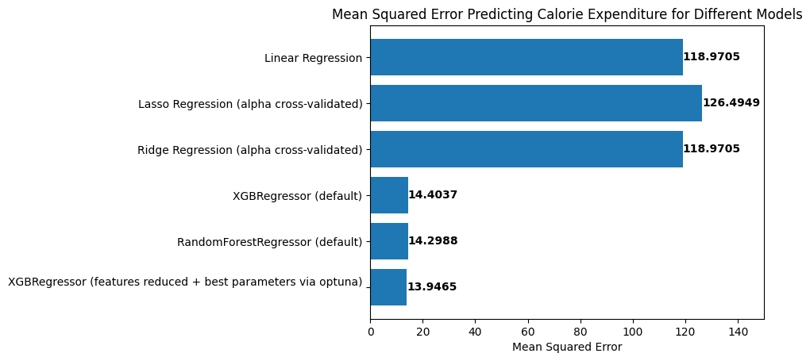

### Model Analysis

Lastly, I wanted to do an analysis of the best model's performance on different subsets of the data, namely different age groups and men vs. women to see if there were groups within the data on which the model performed significantly better or worse. 

Using the same plotting technique as before but representing different subgroups as different colors, we get:

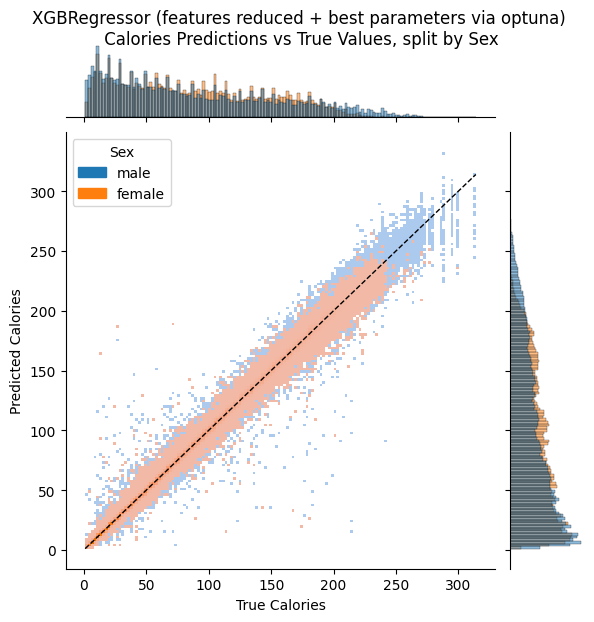
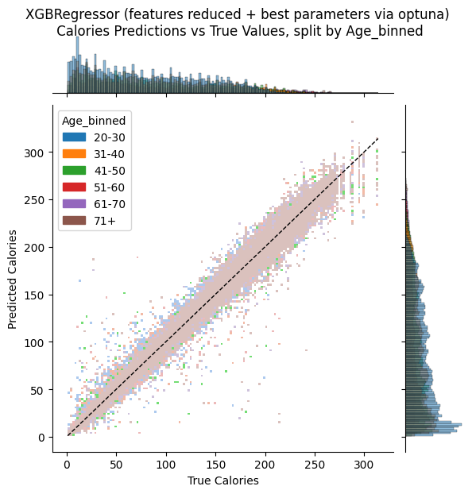

**Takeaways**

- in general, there were greater errors for men than women
- the model tended to have higher errors for younger and older age groups, with the best-performing being people aged 31-40
- there was no apparent overall bias in predictions based on age or sex, that is the model did not tend to over- or under-estimate calories expended for any particular group

## Conclusions

Overall the performance of even just a linear model on this problem is great. Notably, a linear model could be highly interpretable in a way that xgboost isn't.

The linear model could be approximated by and interpreted as:

$$
\text{Calories Burned} = 7 \cdot \text{Number of minutes of exercise} - 22
$$

However, overall the best performance was achieved for xgboost models, which I usually expect for tabular data.
